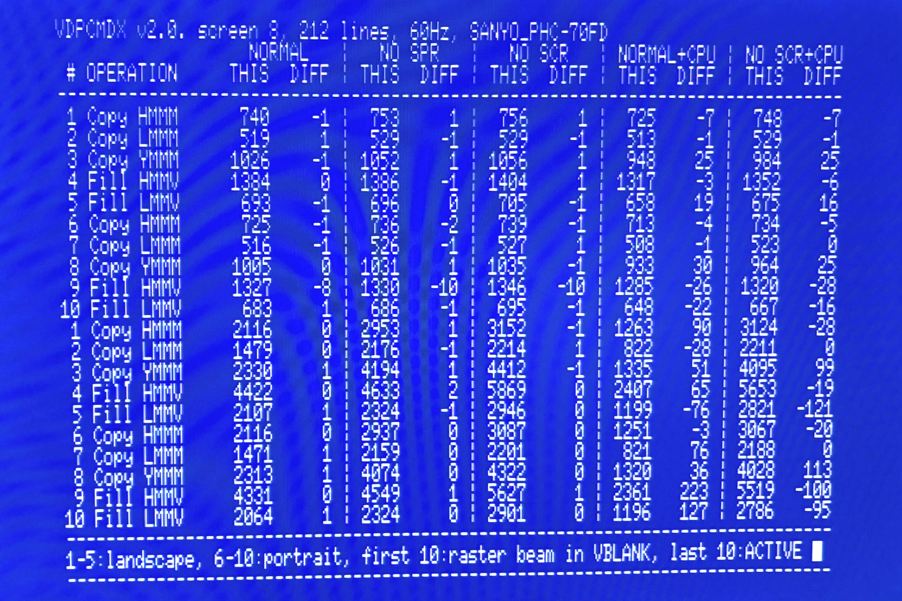

# vdpcmdx | Measure V9938/V9958 command performance on the MSX

**IMPORTANT: If you have downloaded v2.0, please update to v2.1.**

This tool is the successor to [vdpcmd](https://github.com/bengalack/vdpcmd). This time we address the difference between VBLANK AREA and ACTIVE AREA and make it possible to fully automate the tests and write to stdout/files.

Compare your current VDP's command engine performance with real life / target numbers, using this simple __msx dos__ application. Download [here](https://github.com/bengalack/vdpcmdx/raw/refs/heads/master/dska/vdpcmdx.com).

## What it does
It measures the amount of pixels which the command engine is able to "produce" in one full frame, in 192 or 212 line mode, in the 50Hz or 60Hz frequency: Both outside VBLANK and inside ACTIVE AREA, but separated.

**Method:**
* The following is done for VBLANK area (1) and the ACTIVE area (2):
    * We run 5 tests in both landscape and in portrait (10 in total); COPY HMMM, LMMM, YMMM and FILLRECT HMMV, LMMV.
    * The above are run under these conditions:
        * Normal*
        * Sprites off
        * Screen off
        * Normal and VDP is hammered**
        * Screen off and VDP is hammered**

\*(sprites and screen on, the CPU is leaving the VDP alone)  
\**(hammered means the CPU executes continuous unrolled OUT(98),A)

These are the results from Sanyo PHC-70FD in diff mode.

`THIS` columns show the results from the current computer and is measured towards a master value in the `REAL` column. Masterdata comes from Sony HB-F1XD. If run in diff-mode, the `REAL` columns are replaced by `DIFF` columns with shows the diff towards the master - quite useful as it is easier spot discrepancies.

## Help text

## Understanding the results
For real MSX HW, results in conditions 1-3 will likely not diverge much (normal diff is 0-1, maybe a fluke up to 10). Conditions 4 and 5 are harder to get perfect timings on, and we can allow a diff up to ~250 without anything being wrong. I have seen varying results on the same model.

Regardless of the actuall diffs in condition 4 and 5, the value in 4 should be quite lower than in 1, and value in 5 is assumed to be somewhat lower than in 3.

## Detail section
* If you run this on turbo R or in ("Panasonic") turbo mode, the tool jumps into Z80 3.5MHz during test.
* We currently use screen 8. I have tested other screen modes too. They seem identical in performance when we measure in bytes.
* Portrait/Landscape does not matter much, but they do somewhat, and that is why they are included (but I thought the diff would be bigger).
* To understand why condition 4 and 5 is added (and why we allow bigger diffs here), we must refer to [this research](https://map.grauw.nl/articles/vdp-vram-timing/vdp-timing.html) where we see that both the VDP and the CPU is fighting over the same timeslots/timeline. Microsecond timings matter here and different hardware implementations can make a difference.
* REAL:
    * in the vdpcmd/predecessor tool I measured values on SONY HB-F1XDJ (V9958), PANASONIC FS-A1ST (V9958), SANYO PHC-70FD (V9958), PANASONIC A1-WSX (V9958), PANASONIC FS-A1 (V9938). The were pretty much the same, so going further I stick to using one model, SONY HB-F1XD, as master.
    * From the PANASONIC FS-A1 (V9938), PHILIPS NMS 8245 (V9938) and the SONY HB-F1XD which has 0 extra wait states, the "hammered" command costs 18 cycles, while on the others it costs 19 cycles. I can see from my numbers that this affects the amount of pixels in condition 4. The more CPU commands, the less pixels produced by command engine on COPY commands.
* I have tried hammering with both READ and WRITE. They seem identical in performance.

### The actual VDP commands

* Initially page 0 is filled with value 255.
* Initially page 1 is fully cleared (value 0).
* The short side of the rect is 40 pixels (low byte: 40, high byte: 0)
* The long side of the rect is 256 pixels (low byte: 0, high byte: 1)

| Orientation | Command | `sX, sY, sP,  dX, dY, dP,   W,   H, col, arg` | Log Op |
| ----------- | ------- | --------------------------------------------- | ------ |
| HORIZONTAL  | HMMM    | ` 0,  0,  0,   0,  0,  1, 256,  40, 255,   0` | -      |
| HORIZONTAL  | LMMM    | ` 0,  0,  0,   0,  0,  1, 256,  40, 255,   0` | TEOR   |
| HORIZONTAL  | YMMM    | ` 0,  0,  0,   0,  0,  1, 256,  40, 255,   0` | -      |
| HORIZONTAL  | HMMV    | ` 0,  0,  0,   0,  0,  1, 256,  40, 255,   0` | -      |
| HORIZONTAL  | LMMV    | ` 0,  0,  0,   0,  0,  1, 256,  40, 255,   0` | TOR    |
| VERTICAL    | HMMM    | ` 0,  0,  0, 216,  0,  1,  40, 256, 255,   0` | -      |
| VERTICAL    | LMMM    | ` 0,  0,  0, 216,  0,  1,  40, 256, 255,   0` | TEOR   |
| VERTICAL    | YMMM    | ` 0,  0,  0, 216,  0,  1,  40, 256, 255,   0` | -      |
| VERTICAL    | HMMV    | ` 0,  0,  0, 216,  0,  1,  40, 256, 255,   0` | -      |
| VERTICAL    | LMMV    | ` 0,  0,  0, 216,  0,  1,  40, 256, 255,   0` | TOR    |

* `s` means source  
* `d` means destination  
* `p` means page
* The logical commands are arbitrarily chosen (but does not give 0)
* In VERTICAL `dX` had to be moved to 256-width due to YMMM ignoring `W` (width is always 256-sX)
* After each command has been performed and pixels counted, its area is cleared

## Requirements
* **Run:** MSX2 or higher, MSX-DOS
* **Build:** SDCC v4.2 or higher (tested with v4.6)