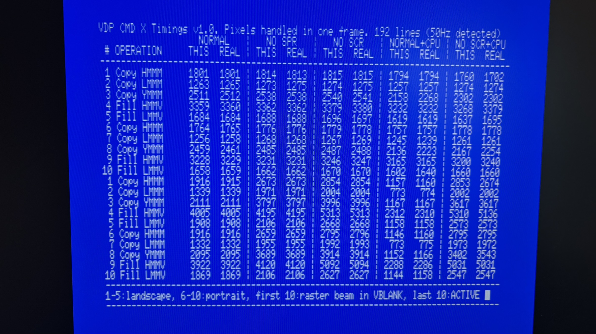

# vdpcmdx | Measure V9938/V9958 command performance on the MSX

This tool is the successor to [vdpcmd](https://github.com/bengalack/vdpcmd). This time we address the difference between VLANK AREA and ACTIVE AREA.

Compare your current VDP's command engine performance with real life / target numbers, using this simple __msx dos__ application. Download [here](https://github.com/bengalack/vdpcmdx/raw/refs/heads/main/dska/vdpcmdx.com).

## What it does
It measures the amount of pixels which the command engine is able to "produce" in one full frame, in 192 line mode, in the current set screen frequency: Both outside VBLANK and inside ACTIVE AREA, but separated.

Both 50Hz and 60Hz are supported. 50Hz/PAL numbers gives "better" results as time in VBLANK is longer in this mode.

See [vdpcmd](https://github.com/bengalack/vdpcmd) for the fundamentals of this tool.

## Requirements
* **Run:** MSX2 or higher, MSX-DOS
* **Build:** SDCC v4.2 or higher (tested with v4.6)